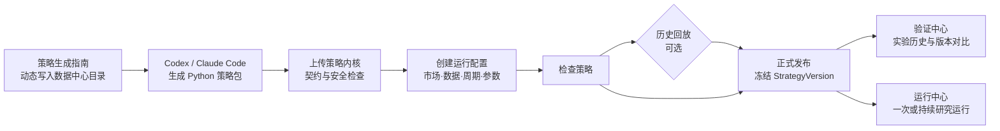
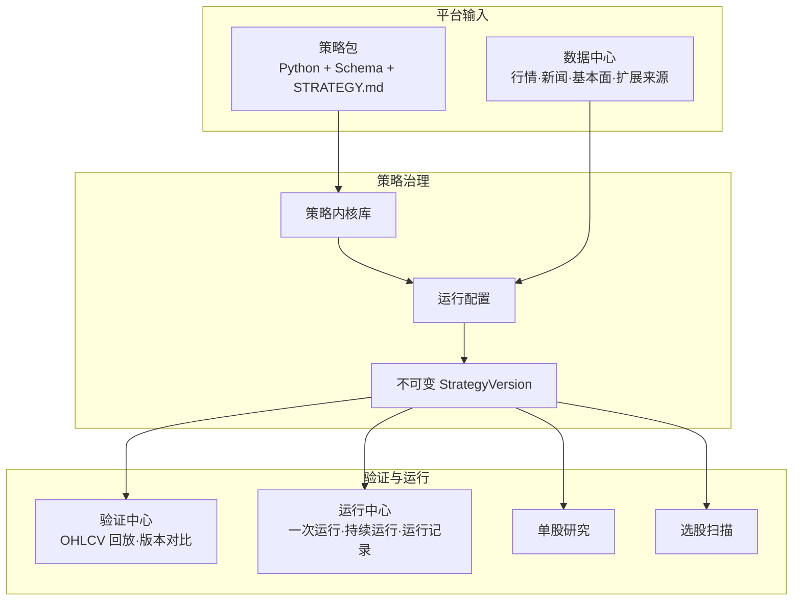

<div align="center">


# LLM TradeBot

**策略内核接入、版本化配置、历史验证与持续研究运行平台**

[](https://github.com/EthanAlgoX/LLM-TradeBot/actions/workflows/ci.yml)
[](LICENSE)
[](https://www.python.org/)
[](https://react.dev/)
[](https://fastapi.tiangolo.com/)

[产品定位](#产品定位) · [核心链路](#核心链路) · [快速开始](#快速开始) · [策略包接入](#策略包接入) · [能力边界](#能力边界) · [开发与测试](#开发与测试)

</div>

> LLM TradeBot 用于接入、配置、验证和持续观察股票研究策略。它不连接券商，不自动下单，也不会把策略发布、历史回放或模型建议描述成真实交易结果。

## 产品定位

LLM TradeBot 不要求用户在网页中搭建 Agent、Prompt 或底层工具链。策略实现由外部工程工具生成或维护，并以具有稳定输入输出契约的 **Python 策略内核** 上传；网站负责把内核与市场、数据源、股票范围、周期、参数和风险边界组合成可运行的完整策略。

平台围绕五个问题展开：

1. 这个策略依赖什么数据，输入和输出是否符合契约？
2. 同一个策略内核在不同市场、周期和参数下表现如何？
3. 哪个不可变版本接受过什么历史验证？
4. 当前运行的是哪个正式版本，何时开始、处于什么状态？
5. 研究报告、候选股票或交易决策提案来自哪次运行，能否追溯？

### 两层策略模型

| 对象 | 负责内容 | 是否可直接运行 |
| --- | --- | --- |
| **策略内核** | Python 实现、输入输出 Schema、数据依赖、参数声明和 `STRATEGY.md` | 否 |
| **完整策略** | 策略内核 + 市场 + 数据来源 + 股票范围 + 周期 + 参数 + 风险边界 | 检查并发布后可以 |
| **StrategyVersion** | 完整策略的不可变版本快照，用于验证、运行和审计 | 正式版本可以 |

同一个内核可以派生多套完整策略，用来比较不同市场、周期或参数，而不必把运行环境写死在策略代码中。

## 核心链路



- **检查策略**：验证内核状态、输入输出契约、数据依赖、市场匹配和运行配置。
- **历史回放**：可以在发布前执行，也可以对已发布的历史版本重新研究；它不是发布的强制条件。
- **正式发布**：只表示策略定义已经冻结，不表示策略已经验证有效。
- **运行中心**：运行正式策略并保存运行记录；当前属于研究运行，不是模拟或真实交易。

### 平台架构



## 三类策略输出

每个策略只能声明一个产品用途和对应输出契约：

| 策略用途 | 输出契约 | 产品入口 | 当前状态 |
| --- | --- | --- | --- |
| 单股研究 `research_report` | `ResearchReport` | 单股研究 | 已接入正式策略选择、任务和报告记录 |
| 选股扫描 `candidate_screening` | `CandidateList` | 选股扫描 | 已接入正式策略选择、任务和候选记录 |
| 交易决策 `trading_decision` | `DecisionProposal` | 验证中心、运行中心 | 已接入观察性回放和研究运行，不生成订单 |

`DecisionProposal` 是研究决策提案，不是订单、成交或持仓指令。

## 开箱即用的策略

平台会在真实数据库中初始化三个普通策略内核，并各自提供一套 A 股运行配置。它们与用户上传的策略使用相同模型和产品入口，不设置特殊分组。

| 策略 | 用途 | 实现基础 | 关键依赖 |
| --- | --- | --- | --- |
| **单股研究策略** | 生成一只股票的结构化研究报告 | 多源证据准备、确定性分析与 LLM 报告生成 | 日线、新闻和基本面均允许按真实链路降级 |
| **多因子选股策略** | 从市场快照生成候选列表 | 硬筛、因子评分、可选 LLM 重排与失败回退 | 全市场快照必需；历史日线、新闻和基本面可选 |
| **研究决策基线** | 生成研究型交易决策提案 | 候选筛选 + OHLCV 可复现规则 + 研究决策内核 | 可形成候选的市场数据必需；新闻和基本面可选 |

研究决策基线只有在本地存在足够真实历史行情时才会形成可直接回放的固定股票池；系统不会编造股票、行情或回测结果。

## 主要页面

| 页面 | 路由 | 作用 |
| --- | --- | --- |
| 策略首页 | `/overview` | 汇总真实策略、验证、运行和数据源状态 |
| 策略中心 | `/strategies` | 管理策略内核、完整策略、版本、复制、检查、发布和删除 |
| 策略生成指南 | `/strategy-development` | 生成可复制给 Codex / Claude Code 的动态策略开发说明 |
| 验证中心 | `/backtests` | 对交易决策版本执行 OHLCV 历史回放、查看实验与版本对比 |
| 运行中心 | `/runs` | 运行已发布的交易决策策略并查看一次/持续运行记录 |
| 数据中心 | `/data` | 查看数据来源、适用市场、连接配置和可用状态 |
| 单股研究 | `/stock-research` | 选择单股研究正式策略，生成并查看研究报告 |
| 选股扫描 | `/screening` | 选择选股正式策略，执行扫描并查看候选结果 |
| 模型用量 | `/usage` | 查看当前模型调用量及可追溯归属 |
| 平台设置 | `/settings` | 配置模型运行时、认证和平台级运行参数 |

## 快速开始

### 环境要求

- Python 3.10+
- Node.js 20.19+ 与 npm 10+
- macOS、Linux 或 Windows（WSL 推荐）

### 本地启动

```bash
git clone git@github.com:EthanAlgoX/LLM-TradeBot.git
cd LLM-TradeBot

python3 -m venv .venv
source .venv/bin/activate
pip install -r requirements.txt

cp .env.example .env

cd apps/dsa-web
npm ci
npm run build
cd ../..

python main.py --serve-only --host 127.0.0.1 --port 8000
```

打开：

- Web：<http://127.0.0.1:8000>
- API 文档：<http://127.0.0.1:8000/docs>

也可以改用其他端口，例如：

```bash
python main.py --serve-only --host 127.0.0.1 --port 8001
```

### 前后端开发模式

```bash
# 终端 1：FastAPI
python main.py --serve-only --host 127.0.0.1 --port 8000

# 终端 2：React / Vite
cd apps/dsa-web
npm run dev
```

开发前端默认访问 <http://127.0.0.1:5173>，`/api` 请求会代理到 `http://127.0.0.1:8000`。

> 不配置 LLM 也可以浏览策略、数据和验证页面；需要模型的策略运行会明确停止并提示配置，不会绕过安全限制。

## 策略包接入

1. 在数据中心确认希望使用的数据来源和市场标签。
2. 打开“策略生成指南”，复制包含当前数据目录的动态说明。
3. 将说明交给 Codex、Claude Code 或其他工程工具，并描述策略想法。
4. 得到包含 `strategy.yaml`、`strategy.py`、Schema、测试和 `STRATEGY.md` 的 ZIP 策略包。
5. 在策略中心上传内核，再创建独立运行配置。
6. 检查策略，按需历史回放，然后正式发布。

策略包唯一执行入口为：

```python
def run(context: StrategyContext) -> StrategyResult:
    ...
```

完整协议、Manifest、输出最低字段和受限执行说明见 [策略包规范](docs/strategy-package-spec.md)。

## 能力边界

### 当前真实能力

- Strategy / StrategyVersion 草稿、检查、乐观并发、不可变发布、复制、差异与删除。
- Python ZIP 策略包上传、静态检查、归档及受限子进程调用。
- 数据来源目录、市场标签、策略依赖和运行配置绑定。
- 单股研究、选股扫描、验证实验和策略运行记录的版本归属与时间留存。
- 交易决策策略的真实本地 OHLCV 观察性历史回放及可信版本对比。
- 已发布交易决策策略的一次研究运行与持续运行控制。

### 尚未实现或明确不属于当前范围

- 券商连接、真实下单、订单、成交、持仓和资金账本。
- 模拟交易撮合、真实收益监控和自动风险放行。
- 对 `ResearchReport` 与 `CandidateList` 的专用历史验证引擎。
- 对任意动态选股策略补造历史时点股票池；缺少历史成分时会明确停止正式回放。
- 通用容器级代码沙箱。当前策略包采用静态白名单、`python -I` 隔离子进程、清洁环境与资源限制，不能视为允许不受信任代码任意执行的安全容器。

验证中心的“回放完成”只代表可信观察性实验执行成功；当前不会自动升级为“策略已验证有效”。详细语义见 [StrategyVersion 历史验证](docs/strategy-version-validation.md)。

## 技术栈

| 层级 | 技术 |
| --- | --- |
| Web | React 19、TypeScript、Vite、React Router、Tailwind CSS、Recharts、Vitest、Playwright |
| API | FastAPI、Pydantic、Uvicorn |
| 服务与存储 | Python、SQLAlchemy、SQLite、本地文件归档 |
| 数据适配 | AkShare、Tushare、Baostock、YFinance、Longbridge 等现有适配器与回退链 |
| 策略执行 | 受限 Python 子进程、标准化输入输出契约、版本快照 |

## 项目结构

```text
LLM-TradeBot/
├── api/                    # FastAPI 路由、Schema 与中间件
├── apps/dsa-web/           # React / TypeScript Web 控制台
├── apps/dsa-desktop/       # Electron 桌面端
├── src/services/           # 策略、验证、运行、数据与报告服务
├── src/schemas/            # 后端领域 Schema
├── data_provider/          # 行情及第三方数据适配器
├── tests/                  # Python 测试
├── docs/                   # 策略协议、验证语义和专题文档
├── main.py                 # CLI 与 Web/API 启动入口
└── server.py               # FastAPI ASGI 入口
```

## 开发与测试

```bash
# 后端门禁
./scripts/ci_gate.sh

# 后端离线测试
python -m pytest -m "not network"

# Web
cd apps/dsa-web
npm run test
npm run lint
npm run build

# 策略定义 smoke（服务启动后）
cd ../..
.venv/bin/python scripts/smoke_strategy_definition.py http://127.0.0.1:8000
```

更多测试说明见 [docs/testing.md](docs/testing.md)。

## License

本项目沿用仓库中的 [MIT License](LICENSE)。原始版权声明和第三方许可必须保留。

## 免责声明

本项目仅用于软件工程、策略研究与历史验证，不构成投资建议。历史回放、研究报告和模型输出均不能保证未来表现。任何交易决策及其后果由使用者自行承担。
