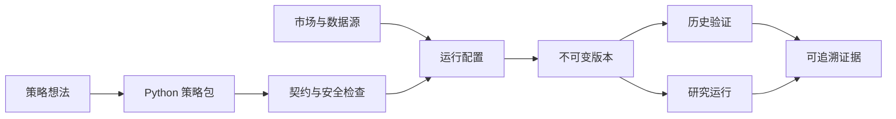

<div align="center">


# LLM TradeBot

**把策略代码变成可配置、可验证、可追溯的股票研究系统**

策略内核 · 不可变版本 · 历史验证 · 持续研究运行

[](https://github.com/EthanAlgoX/LLM-TradeBot/actions/workflows/ci.yml)
[](LICENSE)
[](https://www.python.org/)
[](https://react.dev/)
[](https://fastapi.tiangolo.com/)

[产品定位](#产品定位) · [工作方式](#工作方式) · [快速开始](#快速开始) · [核心能力](#核心能力) · [策略包接入](#策略包接入) · [文档入口](#文档入口)

**简体中文** · [English](docs/README_EN.md)

<br>


</div>

> LLM TradeBot 面向 A 股、港股和美股的策略研究与工程化验证。它不连接券商、不自动下单，也不会把策略发布、历史回放或模型建议包装成真实交易结果。

## 产品定位

LLM TradeBot 关注的不是“再做一个股票聊天机器人”，而是把策略研究中最容易失控的部分变成明确契约：**策略如何接入、数据从哪里来、配置如何组合、版本如何冻结、实验如何复现、结果如何追溯。**

外部工程工具负责生成或维护 Python 策略包；平台负责检查策略契约，并将内核与市场、数据源、股票范围、周期、参数和风险边界组合为可以验证和运行的完整策略。

| 01 · 接入 | 02 · 组合 | 03 · 冻结 | 04 · 研究 |
| --- | --- | --- | --- |
| 上传 Python 策略内核与 Schema | 绑定市场、数据源、周期和参数 | 发布不可变 `StrategyVersion` | 执行历史验证或持续研究运行 |

<div align="center">
  
</div>

### 两层策略模型

| 对象 | 负责内容 | 运行语义 |
| --- | --- | --- |
| **策略内核** | Python 实现、输入输出 Schema、数据依赖、参数声明与 `STRATEGY.md` | 不能脱离配置直接运行 |
| **完整策略** | 策略内核 + 市场 + 数据来源 + 股票范围 + 周期 + 参数 + 风险边界 | 检查并发布后可运行 |
| **StrategyVersion** | 完整策略的不可变版本快照 | 验证、运行与审计的唯一版本依据 |

同一个策略内核可以派生多套完整策略，用来比较不同市场、周期或参数，而不必把运行环境写死在代码里。

## 工作方式



- **检查策略**：验证内核状态、输入输出契约、数据依赖、市场匹配和运行配置。
- **历史验证**：冻结版本和数据快照，保存观察性实验结果；可以在发布前执行，也可以对历史版本重新研究。
- **正式发布**：只表示策略定义已被冻结，不代表策略已经验证有效。
- **研究运行**：保存每次运行的输入、版本、状态和输出；当前不是模拟交易或真实交易。

## 快速开始

### 环境要求

- Python 3.10+
- Node.js 20.19+ 与 npm 10+
- macOS、Linux 或 Windows（推荐 WSL）

### 本地启动

```bash
git clone https://github.com/EthanAlgoX/LLM-TradeBot.git
cd LLM-TradeBot

python3 -m venv .venv
source .venv/bin/activate
pip install -r requirements.txt

cp .env.example .env

cd apps/dsa-web
npm ci
npm run build
cd ../..

python main.py --serve-only --host 127.0.0.1 --port 8000
```

启动后访问：

- Web 控制台：<http://127.0.0.1:8000>
- API 文档：<http://127.0.0.1:8000/docs>

> 不配置 LLM 也可以浏览策略、数据和验证页面。需要模型的策略运行会明确停止并提示配置，不会绕过安全限制。

<details>
<summary><strong>前后端开发模式</strong></summary>

```bash
# 终端 1：FastAPI
python main.py --serve-only --host 127.0.0.1 --port 8000

# 终端 2：React / Vite
cd apps/dsa-web
npm run dev
```

前端默认运行在 <http://127.0.0.1:5173>，`/api` 请求代理到 `http://127.0.0.1:8000`。

</details>

<details>
<summary><strong>Docker 启动</strong></summary>

```bash
cp .env.example .env
docker compose -f docker/docker-compose.yml up -d server
```

完整部署选项见 [部署指南](docs/DEPLOY.md)。

</details>

## 核心能力

| 能力 | 平台提供什么 | 关键约束 |
| --- | --- | --- |
| **策略治理** | 策略草稿、复制、检查、差异、不可变发布与删除 | 正式版本不可原地修改 |
| **策略包运行** | ZIP 上传、静态检查、归档及受限 Python 子进程调用 | 不是通用容器级沙箱 |
| **数据编排** | 多市场数据源目录、依赖声明、运行配置与 fallback | 不伪造缺失行情或历史股票池 |
| **历史验证** | 本地 OHLCV 观察性回放、实验历史与版本对比 | 回放完成不等于策略有效 |
| **研究运行** | 单次与持续运行、状态记录、版本归属和结果留存 | 不产生订单、成交或持仓 |
| **研究产品** | 单股研究、选股扫描与交易决策提案 | 所有结果保留来源与运行归属 |

### 三类策略输出

每个策略只声明一个产品用途和对应输出契约：

| 策略用途 | 输出契约 | 产品入口 |
| --- | --- | --- |
| 单股研究 `research_report` | `ResearchReport` | 单股研究：结构化报告与历史记录 |
| 选股扫描 `candidate_screening` | `CandidateList` | 选股扫描：候选列表与来源记录 |
| 交易决策 `trading_decision` | `DecisionProposal` | 验证中心与运行中心：观察性回放和研究运行 |

`DecisionProposal` 是研究决策提案，不是订单、成交或持仓指令。

### 开箱即用的策略

平台会在真实数据库中初始化三套普通策略内核；它们和用户上传的策略使用同一套模型、版本与产品入口。

| 策略 | 用途 | 实现基础 |
| --- | --- | --- |
| **单股研究策略** | 生成结构化个股研究报告 | 多源证据准备、确定性分析与 LLM 报告生成 |
| **多因子选股策略** | 从市场快照生成候选列表 | 硬筛、因子评分、可选 LLM 重排与失败回退 |
| **研究决策基线** | 生成研究型交易决策提案 | 候选筛选、OHLCV 可复现规则与决策内核 |

系统只在本地存在足够真实历史行情时形成可回放的固定股票池，不会补造股票、行情或回测结果。

### 主要页面

| 页面 | 路由 | 作用 |
| --- | --- | --- |
| 策略首页 | `/overview` | 汇总策略、验证、运行与数据源状态 |
| 策略中心 | `/strategies` | 管理策略、配置、版本、检查与发布 |
| 策略生成指南 | `/strategy-development` | 生成包含当前数据目录的策略开发说明 |
| 验证中心 | `/backtests` | 执行 OHLCV 历史回放并比较实验与版本 |
| 运行中心 | `/runs` | 运行正式策略并查看单次/持续运行记录 |
| 数据中心 | `/data` | 查看来源、市场标签、连接配置与可用状态 |
| 单股研究 | `/stock-research` | 选择正式策略并生成结构化研究报告 |
| 选股扫描 | `/screening` | 选择正式策略并生成候选股票列表 |
| 模型用量 | `/usage` | 查看模型调用量及可追溯归属 |
| 平台设置 | `/settings` | 配置模型运行时、认证和平台参数 |

## 策略包接入

1. 在数据中心确认目标市场与数据来源。
2. 打开“策略生成指南”，复制包含当前数据目录的动态开发说明。
3. 将说明交给 Codex、Claude Code 或其他工程工具，并描述策略想法。
4. 获得包含 `strategy.yaml`、`strategy.py`、Schema、测试和 `STRATEGY.md` 的 ZIP 策略包。
5. 在策略中心上传内核，创建独立运行配置并执行检查。
6. 按需进行历史验证，然后发布不可变版本。

策略包唯一执行入口：

```python
def run(context: StrategyContext) -> StrategyResult:
    ...
```

完整 Manifest、Schema、最低输出字段和受限执行规则见 [策略包规范](docs/strategy-package-spec.md)。

## 能力边界

### 当前明确不做

- 券商连接、自动下单、订单、成交、持仓和资金账本。
- 模拟交易撮合、真实收益监控或自动风险放行。
- 对缺失历史成分的动态选股策略补造历史股票池。
- 把受限 Python 子进程描述为可以安全执行任意不受信任代码的通用沙箱。

验证中心的“回放完成”只代表可信观察性实验执行成功，不会自动升级为“策略已验证有效”。详细语义见 [StrategyVersion 历史验证](docs/strategy-version-validation.md)。

## 技术栈

| 层级 | 技术 |
| --- | --- |
| Web | React 19、TypeScript、Vite、React Router、Tailwind CSS、Recharts、Vitest、Playwright |
| API | FastAPI、Pydantic、Uvicorn |
| 服务与存储 | Python、SQLAlchemy、SQLite、本地文件归档 |
| 数据适配 | AkShare、Tushare、Baostock、YFinance、Longbridge 等适配器与回退链 |
| 策略执行 | 受限 Python 子进程、标准化输入输出契约、不可变版本快照 |

<details>
<summary><strong>项目结构</strong></summary>

```text
LLM-TradeBot/
├── api/                    # FastAPI 路由、Schema 与中间件
├── apps/dsa-web/           # React / TypeScript Web 控制台
├── apps/dsa-desktop/       # Electron 桌面端
├── src/core/               # 分析与运行主流程编排
├── src/services/           # 策略、验证、数据与报告服务
├── src/schemas/            # 后端领域 Schema
├── data_provider/          # 行情与第三方数据适配器
├── tests/                  # Python 测试
├── docs/                   # 配置、协议、验证与专题文档
├── main.py                 # CLI 与 Web/API 启动入口
└── server.py               # FastAPI ASGI 入口
```

</details>

## 文档入口

| 主题 | 文档 |
| --- | --- |
| 文档总览 | [文档中心](docs/INDEX.md) |
| 策略接入 | [策略包规范](docs/strategy-package-spec.md) · [策略架构](docs/strategy-architecture.md) |
| 验证语义 | [StrategyVersion 历史验证](docs/strategy-version-validation.md) |
| 配置与模型 | [完整指南](docs/full-guide.md) · [LLM 配置指南](docs/LLM_CONFIG_GUIDE.md) |
| 部署与桌面端 | [部署指南](docs/DEPLOY.md) · [桌面端打包](docs/desktop-package.md) |
| 开发与测试 | [测试指南](docs/testing.md) · [贡献指南](docs/CONTRIBUTING.md) |

### 开发验证

```bash
# 后端质量门禁
./scripts/ci_gate.sh

# 后端离线测试
python -m pytest -m "not network"

# Web
cd apps/dsa-web
npm run test
npm run lint
npm run build
```

## License

本项目采用 [MIT License](LICENSE)。原始版权声明与第三方许可必须保留。

## 免责声明

本项目仅用于软件工程、策略研究与历史验证，不构成投资建议。历史回放、研究报告和模型输出均不能保证未来表现，任何交易决策及其后果由使用者自行承担。
