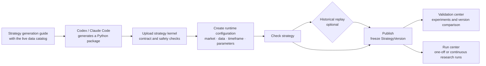
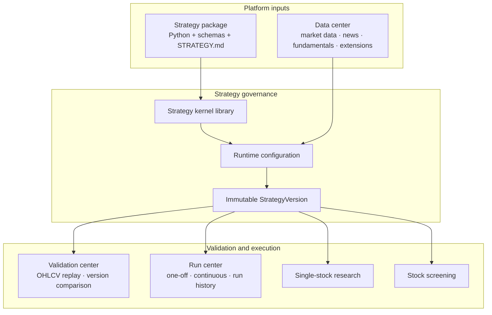

<div align="center">


# LLM TradeBot

**A platform for strategy-kernel intake, versioned configuration, historical validation, and continuous research runs**

[](https://github.com/EthanAlgoX/LLM-TradeBot/actions/workflows/ci.yml)
[](../LICENSE)
[](https://www.python.org/)
[](https://react.dev/)
[](https://fastapi.tiangolo.com/)

[Positioning](#positioning) · [Core lifecycle](#core-lifecycle) · [Quick start](#quick-start) · [Strategy package intake](#strategy-package-intake) · [Capability boundaries](#capability-boundaries) · [Development and testing](#development-and-testing)

[简体中文](../README.md) | **English**

</div>

> LLM TradeBot integrates, configures, validates, and continuously observes stock-research strategies. It does not connect to brokers or place orders, and it never presents publication, historical replay, or model suggestions as real trading results.

## Positioning

LLM TradeBot does not require users to assemble agents, prompts, or low-level tools in the browser. Strategy implementations are generated or maintained with external engineering tools and uploaded as **Python strategy kernels** with stable input and output contracts. The platform combines each kernel with a market, data sources, security universe, timeframe, parameters, and risk boundaries to form a runnable strategy.

The platform is designed to answer five questions:

1. Which data does a strategy require, and do its inputs and outputs satisfy the contract?
2. How does the same kernel behave under different markets, timeframes, and parameters?
3. Which historical validation evidence belongs to each immutable version?
4. Which published version is running, when did it start, and what is its current state?
5. Which run produced a research report, candidate list, or decision proposal, and can that result be traced?

### Two-layer strategy model

| Object | Responsibility | Directly runnable |
| --- | --- | --- |
| **Strategy kernel** | Python implementation, input/output schemas, data dependencies, parameter declarations, and `STRATEGY.md` | No |
| **Complete strategy** | Kernel + market + data sources + universe + timeframe + parameters + risk boundaries | Yes, after checks and publication |
| **StrategyVersion** | Immutable snapshot of a complete strategy for validation, execution, and audit | Published versions only |

One kernel can produce multiple complete strategies, making it possible to compare markets, timeframes, and parameter sets without hard-coding runtime configuration into the strategy implementation.

## Core lifecycle



- **Check strategy** validates kernel readiness, contracts, dependencies, market compatibility, and runtime configuration.
- **Historical replay** can run before publication or against an already published historical version. It is optional.
- **Publication** freezes a definition; it does not prove that the strategy is effective.
- **Run center** executes published strategies and retains run records. Current runs are research runs, not simulated or live trading.

### Platform architecture



## Three strategy outputs

Each strategy declares exactly one product purpose and its corresponding output contract:

| Purpose | Output contract | Product entry | Current status |
| --- | --- | --- | --- |
| Single-stock research `research_report` | `ResearchReport` | Single-stock research | Published-version selection, tasks, and report records are connected |
| Stock screening `candidate_screening` | `CandidateList` | Stock screening | Published-version selection, tasks, and candidate records are connected |
| Trading decision `trading_decision` | `DecisionProposal` | Validation center and run center | Observational replay and research runs are connected; no orders are created |

A `DecisionProposal` is a research proposal, not an order, fill, position, or direct execution instruction.

## Ready-to-use strategies

The platform initializes three ordinary strategy kernels in the real database and provides one A-share runtime configuration for each. They use the same model and product entries as uploaded strategies and are not placed in a special category.

| Strategy | Purpose | Implementation | Key dependencies |
| --- | --- | --- | --- |
| **Single-stock research strategy** | Produce a structured report for one security | Multi-source evidence preparation, deterministic analysis, and LLM report generation | Daily bars, news, and fundamentals may degrade according to the real execution contract |
| **Multi-factor screening strategy** | Produce a ranked candidate list from a market snapshot | Hard filters, factor scoring, optional LLM reranking, and failure fallback | Full-market snapshot required; historical bars, news, and fundamentals optional |
| **Research decision baseline** | Produce a research-oriented trading decision proposal | Candidate screening, reproducible OHLCV rules, and a decision kernel | Market data capable of producing candidates required; news and fundamentals optional |

The research decision baseline becomes immediately replayable only when enough real local historical data exists to freeze a fixed universe. The system does not invent securities, prices, or backtest results.

## Main pages

| Page | Route | Responsibility |
| --- | --- | --- |
| Strategy overview | `/overview` | Summarize real strategy, validation, run, and data-source state |
| Strategy center | `/strategies` | Manage kernels, complete strategies, versions, copies, checks, publication, and deletion |
| Strategy generation guide | `/strategy-development` | Build a dynamic development prompt for Codex or Claude Code |
| Validation center | `/backtests` | Run OHLCV historical replay for decision strategies and compare trusted versions |
| Run center | `/runs` | Execute published decision strategies and inspect one-off or continuous run records |
| Data center | `/data` | Inspect sources, market labels, connection configuration, and availability |
| Single-stock research | `/stock-research` | Select a published research strategy and produce a report |
| Stock screening | `/screening` | Select a published screening strategy and inspect candidates |
| Model usage | `/usage` | Inspect model usage and traceable strategy/run attribution |
| Platform settings | `/settings` | Configure model runtime, authentication, and platform-level runtime settings |

## Quick start

### Requirements

- Python 3.10+
- Node.js 20.19+ and npm 10+
- macOS, Linux, or Windows (WSL recommended)

### Local startup

```bash
git clone git@github.com:EthanAlgoX/LLM-TradeBot.git
cd LLM-TradeBot

python3 -m venv .venv
source .venv/bin/activate
pip install -r requirements.txt

cp .env.example .env

cd apps/dsa-web
npm ci
npm run build
cd ../..

python main.py --serve-only --host 127.0.0.1 --port 8000
```

Open:

- Web: <http://127.0.0.1:8000>
- API docs: <http://127.0.0.1:8000/docs>

To use a different port:

```bash
python main.py --serve-only --host 127.0.0.1 --port 8001
```

### Frontend and backend development

```bash
# Terminal 1: FastAPI
python main.py --serve-only --host 127.0.0.1 --port 8000

# Terminal 2: React / Vite
cd apps/dsa-web
npm run dev
```

The development frontend runs at <http://127.0.0.1:5173> and proxies `/api` to `http://127.0.0.1:8000`.

> You can browse strategy, data, and validation pages without an LLM configuration. Model-dependent runs stop with an explicit configuration prompt; the safety restriction is never bypassed.

## Strategy package intake

1. Confirm the desired data sources and market labels in the data center.
2. Open the strategy generation guide and copy the dynamic instructions containing the current data catalog.
3. Give the instructions and your strategy idea to Codex, Claude Code, or another engineering tool.
4. Generate a ZIP package containing `strategy.yaml`, `strategy.py`, schemas, tests, and `STRATEGY.md`.
5. Upload the kernel in the strategy center and create an independent runtime configuration.
6. Check the strategy, optionally run historical replay, and publish it.

Every strategy package has one execution entry point:

```python
def run(context: StrategyContext) -> StrategyResult:
    ...
```

See the [strategy package specification](strategy-package-spec.md) for the complete manifest, minimum output fields, and restricted execution model.

## Capability boundaries

### Available today

- Strategy and StrategyVersion drafts, checks, optimistic concurrency, immutable publication, copies, diffs, and deletion.
- Python ZIP package upload, static checks, archival, and restricted subprocess invocation.
- Data-source catalog, market labels, dependency declarations, and runtime-configuration binding.
- Version attribution and timestamps for research, screening, validation, and strategy-run records.
- Real local OHLCV observational replay and trusted version comparison for decision strategies.
- One-off and continuous research-run controls for published decision strategies.

### Not implemented or explicitly out of scope

- Broker connections, live orders, fills, positions, and cash ledgers.
- Simulated matching, live P&L monitoring, and automatic risk approval.
- Dedicated historical validation engines for `ResearchReport` and `CandidateList`.
- Fabricated historical constituents for arbitrary dynamic-screening strategies. Formal replay stops when historical universe data is unavailable.
- A general-purpose container sandbox. Strategy packages use a static allowlist, an isolated `python -I` subprocess, a clean environment, and resource limits; this must not be treated as a safe container for arbitrary untrusted code.

“Replay completed” means that a trusted observational experiment executed successfully. It is not automatically upgraded to “strategy validated.” See [StrategyVersion historical validation](strategy-version-validation.md) for the detailed semantics.

## Technology stack

| Layer | Technology |
| --- | --- |
| Web | React 19, TypeScript, Vite, React Router, Tailwind CSS, Recharts, Vitest, Playwright |
| API | FastAPI, Pydantic, Uvicorn |
| Services and storage | Python, SQLAlchemy, SQLite, local package archives |
| Data adapters | Existing AkShare, Tushare, Baostock, YFinance, and Longbridge adapters with fallback routing |
| Strategy execution | Restricted Python subprocess, standardized contracts, version snapshots |

## Repository structure

```text
LLM-TradeBot/
├── api/                    # FastAPI routes, schemas, and middleware
├── apps/dsa-web/           # React / TypeScript web console
├── apps/dsa-desktop/       # Electron desktop app
├── src/services/           # Strategy, validation, run, data, and report services
├── src/schemas/            # Backend domain schemas
├── data_provider/          # Market and third-party data adapters
├── tests/                  # Python tests
├── docs/                   # Strategy contracts, validation semantics, and topic guides
├── main.py                 # CLI and Web/API entry point
└── server.py               # FastAPI ASGI entry point
```

## Development and testing

```bash
# Backend quality gate
./scripts/ci_gate.sh

# Offline backend tests
python -m pytest -m "not network"

# Web
cd apps/dsa-web
npm run test
npm run lint
npm run build

# Strategy-definition smoke test (with the service running)
cd ../..
.venv/bin/python scripts/smoke_strategy_definition.py http://127.0.0.1:8000
```

See [docs/testing.md](testing.md) for additional testing guidance.

## License

This repository is distributed under the included [MIT License](../LICENSE). Existing copyright and third-party license notices must be retained.

## Disclaimer

This project is intended for software engineering, strategy research, and historical validation only. It is not investment advice. Historical replay, research reports, and model outputs do not guarantee future performance. Users are solely responsible for their investment decisions and outcomes.
