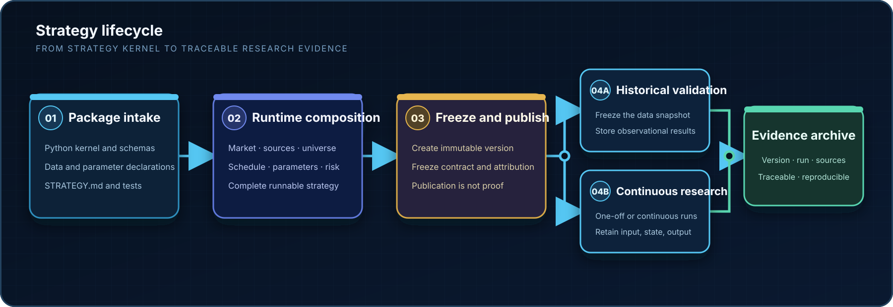
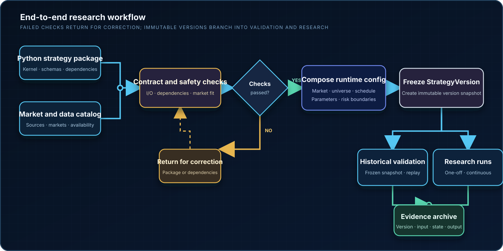

<div align="center">


# LLM TradeBot

**Turn strategy code into a configurable, verifiable, and traceable stock-research system**

Strategy kernels · Immutable versions · Historical validation · Continuous research runs

[](https://github.com/EthanAlgoX/LLM-TradeBot/actions/workflows/ci.yml)
[](../LICENSE)
[](https://www.python.org/)
[](https://react.dev/)
[](https://fastapi.tiangolo.com/)

[Positioning](#positioning) · [How it works](#how-it-works) · [Quick start](#quick-start) · [Core capabilities](#core-capabilities) · [Strategy package intake](#strategy-package-intake) · [Documentation](#documentation)

[简体中文](../README.md) · **English**

<br>


</div>

> LLM TradeBot supports strategy research and engineering validation for mainland China, Hong Kong, and US equities. It does not connect to brokers or place orders, and it never presents publication, historical replay, or model suggestions as real trading results.

## Positioning

LLM TradeBot is not another stock-market chatbot. It turns the parts of strategy research that most often drift out of control into explicit contracts: **how strategies enter the system, where data comes from, how configuration is composed, how versions are frozen, how experiments are reproduced, and how results are traced.**

External engineering tools generate or maintain Python strategy packages. The platform checks their contracts and combines each kernel with a market, data sources, a stock universe, schedule, parameters, and risk boundaries to create a complete strategy that can be validated and run.

| 01 · Import | 02 · Compose | 03 · Freeze | 04 · Research |
| --- | --- | --- | --- |
| Upload a Python kernel and schemas | Bind markets, data, schedules, and parameters | Publish an immutable `StrategyVersion` | Run historical validation or continuous research |

<div align="center">
  
</div>

### Two-layer strategy model

| Object | Responsibility | Runtime semantics |
| --- | --- | --- |
| **Strategy kernel** | Python implementation, input/output schemas, data dependencies, parameter declarations, and `STRATEGY.md` | Cannot run without a configuration |
| **Complete strategy** | Kernel + market + data sources + stock universe + schedule + parameters + risk boundaries | Runnable after checks and publication |
| **StrategyVersion** | Immutable snapshot of a complete strategy | Sole version reference for validation, runs, and audit |

One kernel can produce multiple complete strategies for different markets, schedules, or parameters without hard-coding runtime assumptions into strategy code.

## How it works

<div align="center">
  
</div>

- **Strategy checks** validate kernel state, input/output contracts, data dependencies, market compatibility, and runtime configuration.
- **Historical validation** freezes the version and data snapshot, then persists observational experiment results. It can run before publication or revisit a published version later.
- **Publication** means only that the strategy definition is frozen. It does not mean the strategy has been proven effective.
- **Research runs** retain each run's input, version, status, and output. They are not paper trading or live trading.

## Quick start

### Requirements

- Python 3.10+
- Node.js 20.19+ and npm 10+
- macOS, Linux, or Windows (WSL recommended)

### Local startup

```bash
git clone https://github.com/EthanAlgoX/LLM-TradeBot.git
cd LLM-TradeBot

python3 -m venv .venv
source .venv/bin/activate
pip install -r requirements.txt

cp .env.example .env

cd apps/dsa-web
npm ci
npm run build
cd ../..

python main.py --serve-only --host 127.0.0.1 --port 8000
```

After startup, open:

- Web console: <http://127.0.0.1:8000>
- API documentation: <http://127.0.0.1:8000/docs>

> You can browse strategy, data, and validation pages without an LLM configuration. Runs that require a model stop explicitly and request configuration instead of bypassing safety limits.

<details>
<summary><strong>Frontend and backend development</strong></summary>

```bash
# Terminal 1: FastAPI
python main.py --serve-only --host 127.0.0.1 --port 8000

# Terminal 2: React / Vite
cd apps/dsa-web
npm run dev
```

The frontend runs at <http://127.0.0.1:5173> and proxies `/api` to `http://127.0.0.1:8000`.

</details>

<details>
<summary><strong>Docker startup</strong></summary>

```bash
cp .env.example .env
docker compose -f docker/docker-compose.yml up -d server
```

See the [deployment guide](DEPLOY_EN.md) for complete options.

</details>

## Core capabilities

| Capability | What the platform provides | Key boundary |
| --- | --- | --- |
| **Strategy governance** | Drafts, copies, checks, diffs, immutable publication, and deletion | Published versions cannot be edited in place |
| **Package runtime** | ZIP upload, static checks, archiving, and restricted Python subprocess invocation | Not a general-purpose container sandbox |
| **Data orchestration** | Multi-market source catalog, dependency declarations, runtime configuration, and fallback | Never fabricates missing quotes or historical universes |
| **Historical validation** | Local OHLCV observational replay, experiment history, and version comparison | A completed replay does not prove strategy effectiveness |
| **Research runs** | One-off and continuous runs, status history, version attribution, and retained results | Produces no orders, fills, or positions |
| **Research products** | Single-stock research, candidate screening, and decision proposals | Every result retains its source and run attribution |

### Three strategy outputs

Each strategy declares exactly one product purpose and output contract:

| Strategy purpose | Output contract | Product entry point |
| --- | --- | --- |
| Single-stock research `research_report` | `ResearchReport` | Structured reports and history |
| Candidate screening `candidate_screening` | `CandidateList` | Candidate lists and source records |
| Trading decision `trading_decision` | `DecisionProposal` | Observational replay and research runs in Validation Center and Run Center |

A `DecisionProposal` is a research proposal, not an order, fill, or position instruction.

### Ready-to-use strategies

The platform initializes three ordinary strategy kernels in the real database. They use the same models, versioning, and product entry points as uploaded strategies.

| Strategy | Purpose | Implementation basis |
| --- | --- | --- |
| **Single-stock research strategy** | Produce a structured equity research report | Multi-source evidence, deterministic analysis, and LLM report generation |
| **Multi-factor screening strategy** | Produce candidates from a market snapshot | Hard filters, factor scoring, optional LLM reranking, and failure fallback |
| **Research decision baseline** | Produce a research decision proposal | Candidate selection, reproducible OHLCV rules, and a decision kernel |

The system creates a replayable fixed universe only when sufficient real local market history exists. It never invents symbols, quotes, or backtest results.

### Main pages

| Page | Route | Purpose |
| --- | --- | --- |
| Strategy Overview | `/overview` | Summarize strategy, validation, run, and data-source status |
| Strategy Center | `/strategies` | Manage strategies, configurations, versions, checks, and publication |
| Strategy Generation Guide | `/strategy-development` | Generate development instructions containing the current data catalog |
| Validation Center | `/backtests` | Run OHLCV historical replay and compare experiments and versions |
| Run Center | `/runs` | Run published strategies and inspect one-off or continuous history |
| Data Center | `/data` | Inspect sources, market labels, connection settings, and availability |
| Single-stock Research | `/stock-research` | Select a published strategy and produce a structured report |
| Screening | `/screening` | Select a published strategy and produce a candidate list |
| Model Usage | `/usage` | Inspect model usage and traceable attribution |
| Platform Settings | `/settings` | Configure model runtimes, authentication, and platform parameters |

## Strategy package intake

1. Confirm the target market and sources in Data Center.
2. Open Strategy Generation Guide and copy its dynamic instructions, including the current data catalog.
3. Give those instructions and your strategy idea to Codex, Claude Code, or another engineering tool.
4. Receive a ZIP package containing `strategy.yaml`, `strategy.py`, schemas, tests, and `STRATEGY.md`.
5. Upload the kernel in Strategy Center, create an independent runtime configuration, and run checks.
6. Perform historical validation when needed, then publish an immutable version.

The strategy package has one execution entry point:

```python
def run(context: StrategyContext) -> StrategyResult:
    ...
```

See the [strategy package specification](strategy-package-spec.md) for the full manifest, schemas, minimum output fields, and restricted-execution rules.

## Capability boundaries

### Explicitly out of scope today

- Broker connectivity, automatic order placement, orders, fills, positions, and cash ledgers.
- Paper-trading matching, real-return monitoring, or automated risk approval.
- Fabricating point-in-time universes for dynamic screening strategies when historical constituents are unavailable.
- Presenting the restricted Python subprocess as a general sandbox for arbitrary untrusted code.

“Replay completed” means only that a trustworthy observational experiment executed successfully. It does not automatically become “strategy validated.” See [StrategyVersion historical validation](strategy-version-validation.md) for exact semantics.

## Technology stack

| Layer | Technology |
| --- | --- |
| Web | React 19, TypeScript, Vite, React Router, Tailwind CSS, Recharts, Vitest, Playwright |
| API | FastAPI, Pydantic, Uvicorn |
| Services and storage | Python, SQLAlchemy, SQLite, local file archives |
| Data adapters | AkShare, Tushare, Baostock, YFinance, Longbridge, and existing fallback chains |
| Strategy execution | Restricted Python subprocesses, standardized I/O contracts, immutable version snapshots |

<details>
<summary><strong>Repository structure</strong></summary>

```text
LLM-TradeBot/
├── api/                    # FastAPI routes, schemas, and middleware
├── apps/dsa-web/           # React / TypeScript web console
├── apps/dsa-desktop/       # Electron desktop app
├── src/core/               # Analysis and runtime orchestration
├── src/services/           # Strategy, validation, data, and report services
├── src/schemas/            # Backend domain schemas
├── data_provider/          # Market-data and third-party adapters
├── tests/                  # Python tests
├── docs/                   # Configuration, contracts, validation, and topic docs
├── main.py                 # CLI and Web/API entry point
└── server.py               # FastAPI ASGI entry point
```

</details>

## Documentation

| Topic | Documents |
| --- | --- |
| Documentation map | [Documentation center](INDEX_EN.md) |
| Strategy intake | [Strategy package specification](strategy-package-spec.md) · [Strategy architecture](strategy-architecture.md) |
| Validation semantics | [StrategyVersion historical validation](strategy-version-validation.md) |
| Configuration and models | [Full guide](full-guide_EN.md) · [LLM configuration guide](LLM_CONFIG_GUIDE_EN.md) |
| Deployment and desktop | [Deployment guide](DEPLOY_EN.md) · [Desktop packaging](desktop-package.md) |
| Development and testing | [Testing guide](testing.md) · [Contribution guide](CONTRIBUTING_EN.md) |

### Development validation

```bash
# Backend quality gate
./scripts/ci_gate.sh

# Offline backend tests
python -m pytest -m "not network"

# Web
cd apps/dsa-web
npm run test
npm run lint
npm run build
```

## License

This project is licensed under the [MIT License](../LICENSE). Original copyright notices and third-party licenses must be preserved.

## Disclaimer

This project is for software engineering, strategy research, and historical validation only. It is not investment advice. Historical replays, research reports, and model outputs do not guarantee future performance. Users are responsible for their own trading decisions and outcomes.
