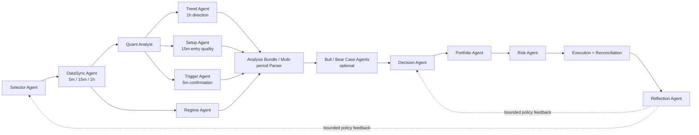

# TradeBot 架构与交付规划

> 状态：基础阶段实施中  
> 最后更新：2026-07-25  
> 目标：将当前 Python 原型演进为以 TypeScript 为主、CLI/TUI 优先、可回测与可审计的多 Agent 加密交易系统。

## 1. 目标与非目标

### 目标

- 建立一套职责清晰、可替换、可测试的多 Agent 交易决策系统。
- 复用一套决策管线支持回测、模拟盘和实盘，而不是维护三套策略逻辑。
- 将所有跨模块数据定义为版本化的 typed contract；执行、风控和策略决策之间不存在隐式调用。
- 保留 CLI/TUI 作为第一产品形态；将来接入 Web UI 时复用同一组应用 API 与事件合同。
- 将每一个交易决定、被拒绝原因、降级、超时和执行结果写入可回放 trace。
- 将每个 Agent 的 schema 校验后输入/输出 artifact 与订单、交易、trace 建立可查询关联，支持亏损复盘。

### 非目标

- 不把 LLM 作为直接下单者；LLM 只能提供结构化观点、反证、置信度修正或 veto 建议。
- 不照搬 LLM-TradeBot 的 Web Dashboard、全局 UI 状态或全部策略阈值。
- 不在第一阶段引入微服务、消息队列或多语言实时 RPC。
- 不将当前回测结果视为策略盈利证明；新增每个 Agent/过滤器都必须做对照与消融回测。

## 2. 当前项目基线

当前 Python 原型已经提供了一个有价值的运行骨架：

```text
Selector -> Data -> Signal/Prediction/Context/Semantic -> Fusion
         -> Decision -> Portfolio -> Risk -> Execution -> Post-Trade
```

已有能力：

- `UnifiedSelectorAgent`：AI500 候选池、市场排名、交易反馈的选币骨架。
- `DataAgent`：模拟或 Binance Futures 行情提供者。
- `DecisionRouterAgent`：开平仓、止盈止损、超时退出和基础规则判断。
- `RiskAuditAgent`：杠杆、保证金、单仓、回撤和风险收益比检查。
- 执行提供者：模拟、纸面和 Binance Futures 实盘安全门。
- SQLite 状态、事件、JSON/JSONL trace 回放，以及 CSV 回测和参数网格。

主要缺口：

- 真实行情目前主要被压缩为 30 根 1m K 线导出的少量标量，不能支撑严格的多周期分析。
- 分析 Agent 之间职责粒度较粗，多个 Agent 实际共享同一份简化输入。
- 默认选币中的 AI500 分数为模拟分数，尚非真实可交易性筛选。
- 复盘目前只是文本提示，尚不能输出可验证、可限幅的策略调整。
- DeepSeek provider 已接入 Bull/Bear 的结构化输出链路；通过 CLI 显式启用，默认保持规则模式。

## 3. 从 LLM-TradeBot 借鉴的内容

借鉴的是 Agent 职责划分和数据流，不是直接复制 UI、全局状态或阈值实现。

| LLM-TradeBot 能力 | 在 TradeBot 中的目标实现 | 迁移原则 |
|---|---|---|
| AUTO1 / AUTO3 Symbol Selector | `SelectorAgent` 产出候选、可交易性、方向性与拒绝原因 | 真实数据驱动；保留 Top-N 和单机会两种策略 |
| DataSync 5m/15m/1h | `DataSyncAgent` 产出对齐的多周期快照 | 区分已收盘 `stable` 和实时 `live` 数据，避免未来函数 |
| Quant Analyst | `QuantAnalystAgent` 输出各周期指标、特征和数值分数 | 只分析，不直接下单 |
| Regime Detector | `RegimeAgent` 判断 trend/choppy/volatile 等市场状态 | 作为开仓资格和风险调整条件 |
| Trend / Setup / Trigger | 1h 方向、15m 入场位置、5m 执行触发三个独立 Agent | 规则实现优先，LLM 实现是可替换增强 |
| Bull / Bear 对抗观点 | `BullCaseAgent` / `BearCaseAgent` 输出正反论据与失效条件 | 可选、并行、超时回退；不能绕过风控 |
| Multi-Period Parser / Decision Core | `DecisionAgent` 消费结构化 `AnalysisBundle` 统一裁决 | 不新建第二套决策管线，升级现有决策层 |
| Reflection Agent | `ReflectionAgent` 输出结构化复盘和有限期 policy adjustment | 不能直接改代码、仓位或风控下限 |
| 全链路审计 | 统一 `CycleTrace` 与事件合同 | CLI/TUI 用 trace 呈现，替代 Dashboard 依赖 |

## 4. 目标运行时架构



### 每个 Agent 的职责和权限

| Agent | 主要输入 | 主要输出 | 权限边界 |
|---|---|---|---|
| Selector | 候选池、流动性、历史表现、市场排名 | `UniverseSet`、选中/拒绝原因 | 不分析后续行情、不下单 |
| DataSync | symbol、`asOf`、timeframes | `MultiTimeframeSnapshot`、数据质量 | 不产生交易结论 |
| Quant Analyst | 多周期已收盘 K 线 | 指标、特征、量化分数 | 不直接决定交易 |
| Regime | 多周期数据与波动特征 | regime、准入限制、风险惩罚 | 不决定方向 |
| Trend | 1h 数据 | long/short/neutral、趋势强度、失效条件 | 不决定进场时机 |
| Setup | 15m 数据和大方向 | ready/wait/avoid、进场位置质量 | 不产生订单 |
| Trigger | 5m 数据和目标方向 | confirmed/waiting、形态、RVOL | 不绕过 setup |
| Bull/Bear Case | `AnalysisBundle` | 正反论证、置信度、反证、veto 建议 | 不产生执行订单 |
| Decision | 分析 bundle、仓位、政策反馈 | `DecisionBundle` / order proposal | 不执行、不绕过风控 |
| Portfolio | 多标的 proposals、账户状态 | 排序后的候选动作 | 不改变单笔风控 |
| Risk | proposal、账户、交易规则 | approve/block/correct | 不发起新交易 |
| Execution | 已批准订单 | execution result、对账状态 | 不修改策略判断 |
| Reflection | 已关闭交易、历史决策与市场上下文 | `ReflectionReport`、有限期调整建议 | 不直接改变仓位和风险底线 |

## 5. 技术方向：TypeScript 主运行时

新架构以 TypeScript 为主语言；当前 Python 项目是行为基线和策略原型，不做逐行翻译。

### TypeScript 承担

- CLI/TUI、配置、Agent 编排、事件和 trace。
- 交易与回测的应用 API、contracts、端口（ports）和适配器（adapters）。
- LLM provider、结构化输出、超时、降级和工具调用。
- 纸面/实盘执行、SQLite 持久化、回放与报告。

### Python 的可选定位

- 离线研究、大规模因子实验、训练预测模型和数据探索。
- 不进入实时交易主链路；若使用，应输出版本化模型、参数或数据文件。

### 推荐目录

```text
tradebot/
  apps/
    cli/                    # CLI 与 TUI
  packages/
    contracts/              # types + runtime schemas + versions
    core/                   # TradingApplication、DecisionPipeline
    agents/                 # 所有 Agent 的协议与实现
    adapters/               # Binance、SQLite、历史数据、paper execution
    backtest/               # BacktestService、撮合、指标、报告
    config/                 # 策略、风险、Agent 开关与版本
  tests/
    fixtures/               # 固定行情、期望决策、回测基准
```

## 6. 接口与合同设计

### 6.1 两层 API

同时保留统一应用 API 和每个 Agent 的独立合同。

```ts
interface TradingApplication {
  runCycle(request: CycleRequest): Promise<CycleResult>;
  inspectCycle(traceId: string): Promise<CycleTrace>;
}

interface BacktestService {
  run(request: BacktestRequest): Promise<BacktestReport>;
  runGrid(request: BacktestGridRequest): Promise<GridReport>;
}

interface Agent<Input, Output> {
  readonly name: string;
  readonly version: string;
  run(input: Input): Promise<Output>;
}
```

统一 API 面向 CLI/TUI、回测和未来 UI；Agent 合同面向编排器和可替换实现。

### 6.2 核心合同

所有跨边界合同均须有：`schemaVersion`、`traceId`、`asOf`、`strategyVersion`；运行时使用 schema 校验（如 Zod），而不只依赖 TypeScript 编译期类型。

```text
CycleRequest
  runMode, asOf, strategyId, configVersion, symbols?, executionEnabled

MultiTimeframeSnapshot
  symbol, asOf, stableBars{5m,15m,1h}, liveQuote, alignment, quality

AnalysisBundle
  quant, regime, trend, setup, trigger, prediction?, reflection?, diagnostics

DirectionalCase
  side, confidence, evidence[], invalidationConditions[], veto?

DecisionBundle
  action, confidence, reason, evidence[], missingConfirmations[], orderIntent?

RiskDecision
  passed, riskLevel, corrections, warnings, blockedReason?

CycleTrace
  stage events, agent name/version, sanitized inputs/outputs, duration, fallbacks
```

动作是统一枚举，任何外部输入进入系统前都必须归一化：

```text
open_long | open_short | close_long | close_short | hold | wait
```

### 6.3 Port / Adapter 边界

```ts
interface MarketDataPort {
  getSnapshot(request: MarketDataRequest): Promise<MultiTimeframeSnapshot>;
}

interface MarketRankPort {
  rank(request: MarketRankRequest): Promise<MarketRankSnapshot>;
}

interface ExecutionPort {
  execute(intent: ApprovedOrderIntent): Promise<ExecutionResult>;
}

interface Clock {
  now(): Date;
}
```

Agent 不知道数据来自 Binance 还是 CSV，也不知道自己正在实盘还是回测。

## 7. 回测设计

回测是独立产品能力，但必须复用 `DecisionPipeline` 和 Agent 合同。

| 抽象 Port | 实盘/纸面实现 | 回测实现 |
|---|---|---|
| `MarketDataPort` | Binance 多周期快照 | 历史数据按 `asOf` 切片 |
| `MarketRankPort` | 当前市场排名 | 历史时点排名或固定 universe |
| `ExecutionPort` | Binance / Paper | 手续费、滑点、流动性、资金费率模拟 |
| `Clock` | UTC 当前时间 | 历史时钟 |
| State Store | SQLite | 内存或回测专用 SQLite |

`BacktestRequest` 必须包含 dataset、时间范围、symbols、timeframes、策略/配置版本、初始资金和执行模型。`BacktestReport` 必须至少包括：绩效、权益曲线、交易列表、成本、回撤、诊断、数据/策略 fingerprint，以及可选 cycle traces。

## 8. LLM 使用策略

- 默认走规则版 Agent，保证低成本、确定性和可回测。
- LLM Agent 与规则 Agent 使用相同输入输出合同。
- LLM 仅用于 Trend/Setup/Trigger 的语义解释或 Bull/Bear 对抗观点。
- 只有在候选通过基础数据质量和市场准入后才调用高成本 LLM。
- 每次 LLM 调用必须有超时、schema 校验、错误回退、输入/输出摘要审计。
- LLM 不得直接生成可执行订单；所有订单仍由 Decision、Portfolio、Risk、Execution 链路处理。

## 9. 交付阶段与进度

| 阶段 | 交付内容 | 验收标准 | 状态 |
|---|---|---|---|
| 0. 设计冻结 | 本文、术语、动作协议、核心 contracts 草案 | 团队确认 API 边界与迁移顺序 | **完成** |
| 1. TS 基础 | monorepo、strict TS、contracts、schema、配置、事件/trace | 固定 fixture 能通过 schema 并生成 trace | **完成**（已提供版本化 `StrategyProfile`、JSON 覆写、稳定 fingerprint，并写入回测/Paper trace 与 journal） |
| 2. 数据与选币 | 多周期 DataSync、真实 Selector、历史与 Binance 公共数据 Port | 5m/15m/1h 对齐；无未来数据读取；输出拒绝原因 | **完成**（参考 LLM-TradeBot 的批量 ticker、多周期 K 线、缓存与完整性检查方式；CSV 历史源、Binance Futures 24h ticker/K 线只读源、真实 Selector、数据质量门和拒绝原因已完成） |
| 3. 规则 Agent | Quant、Regime、Trend、Setup、Trigger、Parser | 每个 Agent 有单测、fixture 和稳定结构化输出 | **完成** |
| 4. 决策链路 | Bull/Bear 规则版、Decision、Portfolio、单笔与账户级 Risk 接入 | 每个动作有证据、缺失确认与拒绝/修正记录 | **完成**（账户级持仓数、保证金比例、单笔名义金额，以及可选累计已实现亏损/相对初始权益损失熔断与 trace 已完成） |
| 5. 回测内核 | HistoricalClock、SimExecution、报告、网格、对照与 Walk-Forward | 同一 Pipeline 可跑回测；结果可复现 | **完成**（权益曲线、回撤、强制平仓、交易统计、参数网格、baseline 对照、稳定多指标排序与无泄漏 Walk-Forward 已完成） |
| 6. 运行时 | Paper/Binance adapter、SQLite、对账、CLI/TUI | paper 稳定运行、完整回放；实盘安全门独立验证 | **进行中**（Paper 状态、单次实时 `paper-cycle`、只读 `preflight`、有边界顺序 `paper-watch`、失败冷却安全守卫、仓位/订单只读对账、Binance 只读 Port、reconcile CUI、SQLite trace 与可刷新 Runtime Dashboard CUI 已完成；长期守护/交互式 TUI、Binance 执行与修复未完成） |
| 7. LLM 与复盘增强 | DeepSeek provider、Bull/Bear、结构化 Reflection、超时和降级 | LLM 故障不会阻断规则决策；复盘不得直接改仓位或风控；结构化输出全量审计 | **进行中**（DeepSeek Bull/Bear/Reflection、schema、超时与规则 fallback，规则 Reflection、SQLite 持久化与脱敏 trace 已完成；自动策略调整未完成） |

## 10. 每阶段质量门

1. **合同先行**：新增功能先定义 contract、schema 和 fixture，再写 Agent 实现。
2. **可重复**：回测必须记录数据、策略、配置和执行模型 fingerprint。
3. **无未来函数**：历史快照只包含 `asOf` 前已经收盘的数据。
4. **单一动作出口**：只允许 `Decision -> Portfolio -> Risk -> Execution` 产生执行动作。
5. **可降级**：数据源、LLM 或可选 Agent 超时必须返回明确 fallback 和 trace 事件。
6. **隔离验证**：每新增一个 Agent/过滤器，至少比较基线与新增后的收益、回撤、交易数、成本敏感度和拒绝率；不能只看最终收益。
7. **安全优先**：实盘功能在纸面、回放、对账和幂等性验证前不启用。

## 11. 下一步

下一次开发从阶段 0/1 开始，先确认：

1. 新 TypeScript 项目的目录与包名；
2. `contracts` 第一版（动作、时间、快照、分析、决策、风险、trace）；
3. 一个固定的历史行情 fixture；
4. `runCycle()` 与 `BacktestService.run()` 的最小可运行骨架。

在这些基础确定前，不迁移具体策略阈值，也不接入 LLM 或实盘执行。
